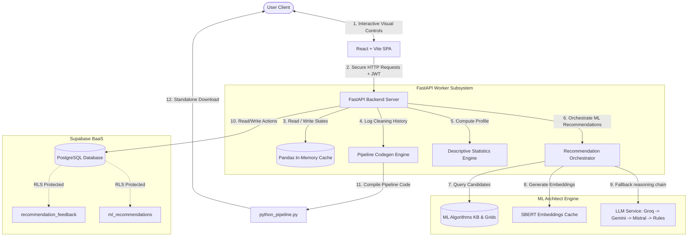

# <div align="center">📊 DataQ</div>

<div align="center">
  <h3>AI-Powered Dataset Quality, Preprocessing & ML Architect Platform</h3>
  <p>Analyze datasets, discover structural anomalies, cleanse data, execute AI-guided ML workflows, select optimal model pipelines, and export production-ready code.</p>

  [](https://vite.dev)
  [](https://react.dev)
  [](https://tailwindcss.com)
  [](https://fastapi.tiangolo.com)
  [](https://www.python.org)
  [](https://supabase.com)
  [](https://scikit-learn.org)
  [](https://docs.pytest.org)
</div>

---

## 🎯 Problem Statement

Data preparation and model selection represent two of the most time-consuming and error-prone phases in the machine learning lifecycle:

1. **Repetitive & Siloed Data Preprocessing**: Data scientists often rewrite boilerplate code to inspect datasets, handle missing values, cap outliers, and encode variables. This process lacks standardized validation and interactive visualization.
2. **Brittle Pipeline Reproducibility**: Visual data preparation tools rarely export clean, standalone, production-ready Python pipelines, leaving developers to manually recreate preprocessing steps in production code, introducing bugs and drift.
3. **Black-box Model Selection**: Finding the optimal model out of dozens of candidate algorithms involves tedious trial-and-error. Teams lack structured tools to filter algorithms dynamically by dataset constraints, task properties, and business explainability needs (e.g., LIME, SHAP, Partial Dependence support).
4. **Lack of Human-in-the-Loop Feedback (RLHF)**: There is no standardized loop to record which models were recommended to users, which ones they accepted, and how they modified hyperparameters, making it impossible to optimize recommendation rules or collect reinforcement learning data.

**DataQ** solves these challenges by uniting interactive data diagnostics, automated AI preprocessing copilots, dynamic scikit-learn code generation, and an intelligent **ML Architect Engine** backed by a robust database persistence layer and user feedback loop.

---

## 🚀 Key Features Implemented

### 1. Advanced Data Inspection & Cleansing Suite
* **Deep Schema Inspection**: Automatically infers column data types, computes descriptive statistics (mean, standard deviation, min, max, quantiles), detects missing ratios, and warns of severe class imbalance.
* **Missing Value Imputation**: Impute missing entries with strategy configurations (Mean, Median, Mode, Constant Value) or drop row subsets with visual missing heatmaps.
* **Outlier Remediation**: Identify anomalies using customizable Z-score and Interquartile Range (IQR) thresholds. Resolve outliers via trimming or capping with real-time pre/post distribution plots.
* **Categorical Encoding**: Convert categories via Label Encoding or One-Hot Encoding (dummy variables) with structural safety checks.
* **Feature Scaling**: Standardize, normalize, or scale features with `StandardScaler`, `MinMaxScaler`, or `RobustScaler`, tracking pre/post scaling distributions.
* **Operation Tracking**: Every data transformation is recorded sequentially in an in-memory session pipeline, enabling seamless **Undo** and **Replay** operations.

### 2. AI Preprocessing Copilot
* **Guided Recommendations**: Leverages LLMs to inspect dataset profiling statistics and recommend tailored cleaning recipes.
* **One-Click Execution**: Instantly convert LLM-suggested cleansing operations into active backend pipeline transformations.

### 3. ML Architect Engine & Knowledge Base (KB)
* **37 Algorithms Knowledge Base**: Configured with a comprehensive JSON knowledge base cataloging classifiers, regressors, and clusterers across distinct model families (e.g., `boosting`, `tree_ensemble`, `linear`, `bagging`, `neural_network`).
* **Multi-Criteria Recommendation**: Filters algorithms dynamically based on dataset dimensions, sparse features, target datatypes, and task specifications.
* **Split Confidences**: Splits final scores into:
  - `pipeline_confidence`: Model-specific performance and matching scoring.
  - `preprocessing_confidence`: Dataset cleaning health (computed dynamically using missing/outlier ratios).
* **Explainability Annotations**: Flags models based on explainability properties: `supports_partial_dependence`, `supports_permutation_importance`, and `supports_lime`.
* **Hyperparameter Grid Generation**: Provides default hyperparameter search grids mapped to all 37 algorithms for downstream tuning.
* **Model Pipeline Codegen**: Generates executable, production-grade scikit-learn Pipeline scripts linking the custom preprocessing steps with the recommended classifier/regressor.

### 4. Supabase Database Integration & Security
* **Persistent Runs**: Logs recommendations generated during sessions in `ml_recommendations` with the top recommended model, confidence score breakdown, and full scoring rankings.
* **RLHF Feedback Capture**: Persists user model selections and acceptances in `recommendation_feedback` to construct feedback data.
* **Row-Level Security (RLS)**: Enforces owner-bound access controls on all tables (`datasets`, `sessions`, `operations`, `ml_recommendations`, `recommendation_feedback`) ensuring users can only read or write their own data.
* **JWT Authentication**: Protects FastAPI endpoints using token validation tied to Supabase auth providers.

---

## 🗺️ System Architecture

DataQ separates user interactions, stateless backend preprocessing workers, LLM reasoning logic, and persistent tracking:



---

## 📂 Project Structure

```text
DataQ/
├── backend/                        # FastAPI Python backend
│   ├── app/
│   │   ├── codegen/                # Python cleaning script templates
│   │   ├── config/                 # App settings, CORS, and limits
│   │   ├── core/                   # JWT and authorization helpers
│   │   ├── exceptions/             # Custom platform exceptions (validation, dataset, session)
│   │   ├── ml/                     # ML Architect Engine
│   │   │   ├── embeddings/         # SBERT Embedding cache models & service
│   │   │   ├── filters/            # Task-specific algorithm filtering (datatype, task constraints)
│   │   │   ├── kb/                 # Knowledge Base (ml_algorithm_kb.json, hyperparameters.json)
│   │   │   ├── models/             # Algorithm profiling & criteria models
│   │   │   ├── pipeline/           # Scikit-learn Pipeline codegen
│   │   │   ├── profiling/          # Dataset profiling for ML recommendations
│   │   │   ├── ranking/            # Multi-criteria scoring & ranking
│   │   │   ├── reasoning/          # LLM & fallback reasoning (Gemini/Groq/Mistral/Rules)
│   │   │   ├── routers/            # ML recommendation & feedback API routes
│   │   │   ├── schemas/            # Recommendation schemas (Pydantic validation)
│   │   │   └── services/           # Recommendation engine orchestrator
│   │   ├── models/                 # Data models & operation definitions
│   │   ├── routers/                # API endpoints (upload, inspect, outliers, missing, etc.)
│   │   ├── schemas/                # Pydantic validation schemas
│   │   ├── services/               # Core business logic (scaling, missing, outlier detection)
│   │   ├── storage/                # Local staging storage (uploads and logs)
│   │   └── utils/                  # In-memory dataframe caching & cache cleanups
│   │   └── main.py                 # FastAPI application entrypoint
│   ├── tests/                      # Backend unit and integration test suites
│   ├── dataq.sql                   # Supabase schema definitions, policies, & tables
│   ├── ml_algorithm_kb.json        # ML algorithm knowledge base config source
│   └── requirements.txt            # Python dependencies
│
├── frontend/                       # React SPA frontend
│   ├── src/
│   │   ├── components/             # Custom components (Bento grid, Charts, UI elements)
│   │   ├── context/                # React context provider (session data storage)
│   │   ├── hooks/                  # Custom hooks for state queries (useDataset, useOperations)
│   │   ├── layouts/                # Layout modules (DashboardLayout)
│   │   ├── pages/                  # App pages (Landing, Login, Scaling, Outliers, Agent, etc.)
│   │   ├── services/               # API clients mapping to backend routers
│   │   └── styles.css              # Core stylesheet powered by Tailwind CSS v4
│   ├── package.json                # Node dependencies and scripts
│   └── vite.config.ts              # Vite environment configs
│
└── .gitignore                      # Global project ignores
```

---

## 🛠️ Quick Start

### 1. Backend Setup (FastAPI)

Ensure you have Python 3.10+ installed.

1. Navigate to the backend directory:
   ```bash
   cd backend
   ```
2. Create and activate a virtual environment:
   ```bash
   python -m venv venv
   # On Windows:
   venv\Scripts\activate
   # On macOS/Linux:
   source venv/bin/activate
   ```
3. Install dependencies:
   ```bash
   pip install -r requirements.txt
   ```
4. Start the FastAPI development server:
   ```bash
   uvicorn app.main:app --host 127.0.0.1 --port 8000 --reload
   ```

> [!TIP]
> The backend features interactive Swagger API documentation. Visit [http://127.0.0.1:8000/docs](http://127.0.0.1:8000/docs) to explore endpoints live.

---

### 2. Run Test Suites

Verify backend stability, schema rules, and ML algorithms integrity using pytest:
```bash
# Run all tests
pytest

# Run ML Architect-specific tests
pytest tests/test_ml_profiler.py \
       tests/test_ml_filters.py \
       tests/test_ml_ranking.py \
       tests/test_ml_recommend.py \
       tests/test_pipeline_generator.py \
       tests/test_llm_reasoner.py \
       tests/test_embeddings_cache.py \
       tests/test_kb_integrity.py -v
```

---

### 3. Frontend Setup (React + Vite)

Ensure you have Node.js 18+ installed.

1. Navigate to the frontend directory:
   ```bash
   cd frontend
   ```
2. Install dependencies:
   ```bash
   npm install
   ```
3. Create a local environment file `frontend/.env`:
   ```env
   VITE_API_BASE_URL=http://127.0.0.1:8000/api/v1
   ```
4. Start the Vite development server:
   ```bash
   npm run dev
   ```
5. Open your browser and navigate to [http://localhost:8080](http://localhost:8080).

---

## 💎 Features & Cleansing Suite Details

| Module | Features Supported | Key Visualizations |
| :--- | :--- | :--- |
| **Inspect** | Null counts, data types, distinct values, histograms | Distribution Plots, Recharts Data Grid |
| **Missing Values** | Imputation (Mean, Median, Mode, Constant), Drop Rows | Missing Value Heatmap |
| **Outliers** | IQR Range, Z-score thresholds, Capping, Trimming | Scatter Plots & Whisker Charts |
| **Encoding** | One-Hot (Dummy variables), Label Encoding | Schema mapping previews |
| **Scaling** | MinMaxScaler, StandardScaler, RobustScaler | Pre/Post Scaling distribution charts |
| **Pipeline Studio** | Tracks cleaning history, constructs executable Python script | Standard code editor view |
| **ML Architect** | Recommend best-suited ML algorithms (from 37 classifiers, regressors, and clusterers), split confidence scores (`preprocessing_confidence` and `pipeline_confidence`), model explainability metadata (`supports_lime`, etc.), default hyperparameter search grids | Model recommendation & explainability dashboard |
| **User Feedback** | RLHF user acceptance logging, persistent recommendation histories via Supabase backend services, owner-bound data access security (RLS) | Feedback widgets & run logs |

---

## 🧪 Verification & Test Suites Detail

DataQ maintains 20+ ML unit and integration test suites:
1. `test_pipeline_generator.py`: Verifies scikit-learn Pipeline code generation for all 37 algorithms in the KB.
2. `test_llm_reasoner.py`: Mocks sequential AI provider fallbacks (Groq fails $\rightarrow$ Gemini fails $\rightarrow$ Mistral succeeds) and confirms fallback rules.
3. `test_embeddings_cache.py`: Validates saving, reloading, and invalidation of `cached_embeddings.pkl` when the KB file hash changes.
4. `test_kb_integrity.py`: Assures JSON structural integrity and metadata constraints across all 37 entries in the KB files.
5. `test_ml_profiler.py`, `test_ml_filters.py`, `test_ml_ranking.py`, `test_ml_recommend.py`: Validate recommendation filtering, scoring, and profiling metrics.
6. `test_supabase.py`: Checks client configuration, operations history CRUD, feedback tables, and session creations.

---

## 🔒 Database Schema & Security (Supabase)

DataQ's schema details are described in `dataq.sql` and include:
* **`profiles`**: Tied to `auth.users` via a Supabase Auth signup trigger.
* **`datasets`**: Captures filename, size, and schema info.
* **`sessions` & `operations`**: Records step-by-step cleaning operations for the Undo/Replay and Pipeline engine.
* **`ml_recommendations`**: Logs every generated model recommendation run, enabling session audit logs.
* **`recommendation_feedback`**: Logs RLHF model acceptance (`accepted` boolean) to capture human preferences.
* **Row-Level Security (RLS)**: Enforces that users can only select/insert/update rows belonging to their own `user_id` or session tree, preventing cross-tenant access.

---

## 📜 License

Distributed under the MIT License. See `LICENSE` for more information.
